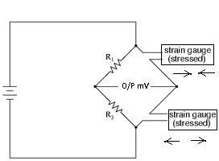
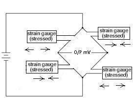
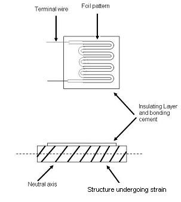

### **Prerequisite**

### **What do we mean by Stress?**

Stress is the force generated inside an object in response to an applied external force.This internal force divided by the cross-sectional area of the object is called stress,which is expressed in Pa (Pascal) or N/m2.If the direction of the external force is vertical to the cross-sectional area, the stress is called **vertical stress**.

### **What do we mean by strain?**
When a bar is pulled, it causes change in its length by &Delta;L, making its new length = L (original length) + &Delta;L (change in length).
The ratio of this change in length &Delta;L, to the original length, L, is called strain.
The strain is expressed in &epsilon; (epsilon): &epsilon; = &Delta;L / L
Strain in the same direction as the external force is called longitudinal strain.
Since strain is a ratio, it is an absolute number having no unit.
Strain in the direction perpendicular to the external force is called lateral strain.
Each material has a certain ratio of lateral strain to longitudinal strain.This ratio is called Poisson's ratio.

### **V = - (d&epsilon;(trans)/ d&epsilon;(axial))**
where
V is the resulting **Poisson's ratio**,
**&epsilon;(trans)** is transverse strain (negative for axial tension (stretching), positive for axial compression)
**&epsilon;(axial)** is axial strain (positive for axial tension, negative for axial compression).
The value of stress is directly proportional to the strain. Thus we can find the stress in a material if we can find the strain initiated by external force.

### **Introduction to Strain Gauge**
Strain gauge transducer transforms mechanical elongation and compression into measurable value.

### **Types of Strain Gauges based on principle of working:**
1. **Mechanical:** It is made up of two separate plastic layers. The bottom layer has a ruled scale on it and the top layer has a red arrow or pointer. One layer is glued to one side of the crack and one layer to the other. As the crack opens,the layers slide very slowly past one another and the pointer moves over the scale.The red crosshairs move on the scale as the crack widens. Some mechanical strain gauges are even more crude than this. The piece of plastic or glass is stick across a crack and observed its nature.

2. **Electrical:** The most common electrical strain gauges are thin, rectangular-shaped strips of foil with maze-like wiring patterns on them leading to a couple of electrical cables.
When the material is strained, the foil strip is very slightly bent out of shape and the maze-like wires are either pulled apart (so their wires are stretched slightly thinner) or pushed together (so the wires are pushed together and become slightly thicker). Changing the width of a metal wire changes its electrical resistance. This change in resistance is proportional to the stress applied. If the forces involved are small, the deformation is elastic and the strain gauge eventually returns to its original shape.

3. **Piezoelectric:** Some materials such as quartz crystals and various types of ceramics, are effectively "natural" strain gauges.
When pushed and pulled, they generate tiny electrical voltages between their opposite faces.
This phenomenon is called piezoelectricity.
By measuring the voltage from a piezoelectric sensor we can easily calculate the strain.
Piezoelectric strain gauges are the most sensitive and reliable devices.

**Electrical Strain Gauge:** A strain gauge takes advantage of the physical property of electrical conductance. It does not depend on merely the electrical conductivity of a conductor, but also the conductor's geometry. When an electrical conductor is stretched within the limits of its elasticity such that it does not break or permanently deform, it will become narrower and longer. Similarly, when it is compressed, it will broaden and shorten. The change in the resistance is due to variation in the length and cross sectional area of gauge wire.

### **Gauge Factor:**
The characteristics of the strain gauges are described in terms of its sensitivity (gauge factor). Gauge factor is defined as unit change in resistance for per unit change in length of strain gauge wire given as

**G.F. = (&Delta;R/RG) / &epsilon;**
where,
**&Delta;R** - the change in resistance caused by strain,
**RG** - is the resistance of the unreformed gauge, and
**&epsilon;** – is strain.

### **Effect of Temperature:**
The resistive type strain gauges are sensitive to temperature variation; therefore it becomes necessary to account for variations in strain gauge resistance due to temperature changes. Using dummy gauge in opposite arm of the active gauge compensates the temperature variation.

### **Arrangement:**
In certain applications where equal and opposite strains are known to exist it is possible to attach similar gauges in way that one gauge experiences positive strain and other negative strain. Depending on the number of gauges used the bridge, the circuit configurations are :
### 1. Quarter Bridge :

### 2. Half Bridge :

### 3. Full Bridge :

In Quarter Bridge, the strain gauge is connected in one arm as shown in the above diagram. In half bridge arrangement two active gauges are used, while in case of full bridge all the gauges are active. In this arrangement two acts in tension while other two are compression. With the help of this type of arrangement temperature compensation is also achieved. When possible, the full-bridge configuration is the best to use. This is true not only because it is more sensitive than the others, but because it is linear while the others are not. Quarter-bridge and half-bridge circuits provide an output (imbalance) signal that is only approximately proportional to applied strain gauge force. Linearity, or proportionality, of these bridge circuits is best when the amount of resistance change due to applied force is very small compared to the nominal resistance of the gauge(s). With a full-bridge, however, the output voltage is directly proportional to applied force, with no approximation.

### **Effect of Lead-Wire:**
Strain gauges are sometimes mounted at a distance from the measuring equipment. This increases the possibility of errors due to temperature variations, lead desensitization, and lead-wire resistance changes.

### Two wire:
In a **two-wire installation**, as shown in figure, the two leads are in series with the strain-gauge element, and any change in the lead-wire resistance (R1) will be indistinguishable from changes in the resistance of the strain gage (Rg). In two-wire installations, the error introduced by lead-wire resistance is a function of the resistance ratio R1/Rg. The lead error is usually not significant if the lead-wire resistance (R1) is small in comparison to the gage resistance (Rg), but if the lead-wire resistance exceeds 0.1% of the nominal gage resistance, this source of error becomes significant. Therefore, in industrial applications, lead-wire lengths should be minimized or eliminated by locating the transmitter directly at the sensor.

### **Three wire:**
To correct for lead-wire effects, an additional, third lead can be introduced to the top arm of the bridge, **as shown in the above Figure**. In this configuration, wire C acts as a sense lead with no current flowing in it, and wires A and B are in opposite legs of the bridge. This is the minimum acceptable method of wiring strain gages to a bridge to cancel at least part of the effect of extension wire errors. Theoretically, if the lead wires to the sensor have the same nominal resistance, the same temperature coefficient, and are maintained at the same temperature, full compensation is obtained. In reality, wires are manufactured to a tolerance of about 10%, and three-wire installation does not completely eliminate two-wire errors, but it does reduce them by an order of magnitude.
If further improvement is desired, four-wire and offset-compensated installations should be considered.

### **Types of strain gauge based on construction:**
**Optical sensors** are sensitive and accurate, but are delicate and not very popular in industrial applications. They use interference fringes produced by optical flats to measure strain. Optical sensors operate best under laboratory conditions.
**The photoelectric gauge** uses a light beam, two fine gratings, and a photocell detector to generate an electrical current that is proportional to strain. The gage length of these devices can be as short as 1/16 inch, but they are costly and delicate.
**Semiconductor strain gauges:** For measurements of small strain, semiconductor strain gauges, so called piezoresistors, are often preferred over foil gauges. Semiconductor strain gauges depend on the piezoresistive effects of silicon or germanium and measure the change in resistance with stress as opposed to strain. The semiconductor bonded strain gauge is a wafer with the resistance element diffused into a substrate of silicon. The wafer element usually is not provided with a backing, and bonding it to the strained surface requires great care as only a thin layer of epoxy is used to attach it. The size is much smaller and the cost much lower than for a metallic foil sensor. The same epoxies that are used to attach foil gages are used to bond semiconductor gages. The advantages are higher unit resistance and sensitivity whereas, greater sensitivity to temperature variations and tendency to drift are disadvantages in comparison to metallic foil sensors. Another disadvantage of semiconductor strain gages is that the resistance-to-strain relationship is nonlinear. With software compensation this can be avoided.

**Thin-film strain gauge:** These gauges eliminate the need for adhesive bonding. The gauge is produced by first depositing an electrical insulation (typically a ceramic) onto the stressed metal surface, and then depositing the strain gauge onto this insulation layer. Vacuum deposition or sputtering techniques are used to bond the materials molecularly. Because the thin-film gauge is molecularly bonded to the specimen, the installation is much more stable and the resistance values experience less drift. Another advantage is that the stressed force detector can be a metallic diaphragm or beam with a deposited layer of ceramic insulation.

**Diffused semiconductor strain gauges:** This is a further improvement in strain gage technology as they eliminate the need for bonding agents. By eliminating bonding agents, errors due to creep and hysteresis also are eliminated. The diffused semiconductor strain gage uses photolithography masking techniques and solid-state diffusion of boron to molecularly bond the resistance elements. Electrical leads are directly attached to the pattern.

The diffused gauge is limited to moderate-temperature applications and requires temperature compensation.

Diffused semiconductors often are used as sensing elements in pressure transducers. They are small, inexpensive, accurate and repeatable, provide a wide pressure range, and generate a strong output signal. Their limitations include sensitivity to ambient temperature variations, which can be compensated for in intelligent transmitter designs.

### **Types of strain gauge based on mounting:**
#### **Bonded strain gauge:**
A bonded strain-gage element, consisting of a metallic wire, etched foil, vacuum-deposited film, or semiconductor bar, is cemented to the strained surface.

### **Unbonded Strain Gauge:**
The unbonded strain gage consists of a wire stretched between two points in an insulating medium such as air. One end of the wire is fixed and the other end is attached to a movable element.

### **Strain gauge selection criteria:**
* Gauge Length
* Number of Gauges in Gauge Pattern
* Arrangement of Gauges in Gauge Pattern
* Grid Resistance
* Mass
* Stability
* Temperature sensitivity
* Carrier Material
* Gauge Width
* Availability
* Low cost
* Effect of ambient conditions